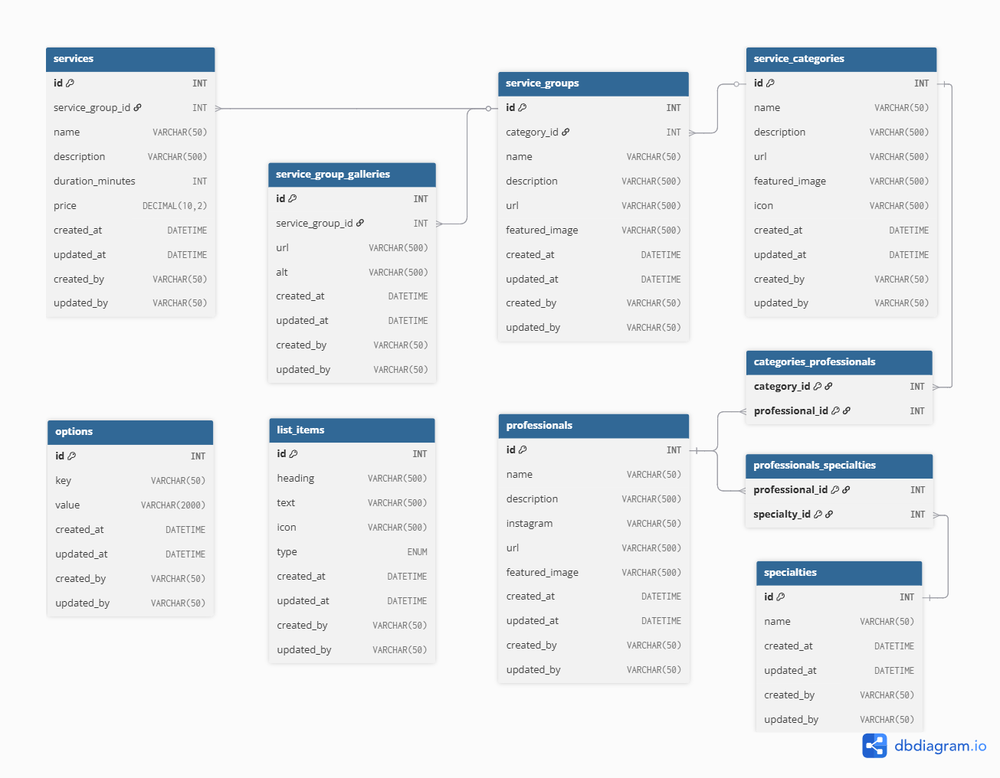

# 1. Context

## 1.1. Project Overview
This document defines the Entity-Relationship and Logical data models for the Espaço Valter Cardoso CMS.

## 1.2. Business Objective
To provide a robust and dynamic back-end foundation that allows administrators to seamlessly update website content. It is designed to act as a digital showcase, highlighting the salon's authority in the beauty and aesthetics market.

## 1.2. System Scope
The architecture handles complex relationships within the beauty industry, such as linking professionals to multiple multidisciplinary specialties, categorizing services into specific groups, managing image galleries, and controlling dynamic UI elements (like list items and global options) directly from the database.

# 2. Entity-Relationship Model

## 2.1. Entity

| Entity | Atributes |
| --- | --- |
| SERVICE | id, name, description, duration, price | 
| SERVICE GROUP | id, name, description, url, featured image, gallery* |
| SERVICE CATEGORY | id, name, description, icon, url |
| PROFESSIONAL | id, name, specialty, description, url, instagram |
| SPECIALTIES | id, name
| LIST ITEMS | id, heading, text, icon
| OPTIONS | id, key, value |

*(\*) Needs a new table*

## 2.2. Relationship
- SERVICE *belongs to* SERVICE GROUP
- SERVICE GROUP *belongs to* CATEGORY
- PROFESSIONAL *belongs to* CATEGORY
- PROFESSIONAL *has* SPECIALTY

# 3. Entity-Relationship Diagram


# 4. Logical model
*All tables, except the pivot tables, include standard audit columns (created_at, updated_at, created_by, updated_by).*

## 4.1. services

| id | group_id | name | description | duration_minutes | price |
|---|---|---|---|---|---|
| 1 | 1 | Corte feminino 1 | Service description... | 30 | 90.00 |
| 2 | 1 | Corte feminino 2 | Service description... | 60 | 120.00 |
| 4 | 4 | Tintura 1 | Service description... | 120 | 150.00 |
| 8 | 5 | Mechas 1 | Service description... | 360 | 90.00 |
| 9 | 5 | Mechas 2 | Service description... | 420 | 90.00 |

## 4.2. service_groups

| id | category_id | name | description | url | featured_image |
|---|---|---|---|---|---|
| 1 | 1 | Corte feminino | Lorem ipsum | /.../corte-feminino | /.../corte-feminino-cover.jpeg |
| 2 | 1 | Corte masculino | Lorem ipsum | /.../corte-masculino | /.../corte-masculino-cover.jpeg |
| 3 | 1 | Corte infantil | Lorem ipsum | /.../corte-infantil | /.../corte-infantil-cover.jpeg |
| 4 | 1 | Tintura | Lorem ipsum | /.../tintura | /.../tintura-cover.jpeg |
| 5 | 1 | Loiros | Lorem ipsum | /.../loiros | /.../loiros-cover.jpeg |

## 4.3. service_group_galleries

| id | group_id | url | alt |
|---|---|---|---|
| 1 | 1 | /.../corte-feminino-01.jpeg | Lorem ipsum... |
| 2 | 1 | /.../corte-feminino-02.jpeg | Lorem ipsum... |
| 4 | 2 | /.../corte-masculino-01.jpeg | Lorem ipsum... |
| 5 | 2 | /.../corte-masculino-02.jpeg | Lorem ipsum... |
| 7 | 3 | /.../corte-infantil-01.jpeg | Lorem ipsum... |
| 8 | 3 | /.../corte-infantil-02.jpeg | Lorem ipsum... |
| 9 | 4 | /.../tintura-01.jpeg | Lorem ipsum... |
| 10 | 5 | /.../loiros-01.jpeg | Lorem ipsum... |
| 11 | 5 | /.../loiros-02.jpeg | Lorem ipsum... |

## 4.4. service_categories

| id | name | description | url | featured_image | icon |
|---|---|---|---|---|---|
| 1 | Cabelo | Lorem ipsum | /cabelo | /.../.cabelo-cover.jpeg | /.../cabelo.svg |
| 2 | Estética | Lorem ipsum | /estetica | /.../estetica-cover.jpeg | /.../estetica.svg |
| 3 | Unhas | Lorem ipsum | /unhas | /.../unhas-cover.jpeg | /.../unhas.svg |

## 4.5. professionals

| id | name | description | instagram | url | featured_image |
|---|---|---|---|---|---|
| 1 | Núbia | Lorem ipsum | nubia | /.../nubia | /.../nubia.jpeg |
| 2 | Juliana | Lorem ipsum | juliana | /.../juliana | /.../juliana.jpeg |
| 3 | Valter | Lorem ipsum | valter | /.../valter | /.../valter.jpeg |
| 4 | Cristiane | Lorem ipsum | cristiane | /.../cristiane | /.../cristiane.jpeg |
| 5 | Adriana | Lorem ipsum | adriana | /.../adriana | /.../adriana.jpeg |

## 4.6. specialties

| id | name |
|---|---|
| 1 | Cabeleireiro |
| 2 | Esteticista |
| 3 | Manicure |

## 4.7. professionals_specialties

| professional_id | specialty_id |
|---|---|
| 1 | 2 |
| 2 | 1 |
| 3 | 1 |
| 4 | 3 |
| 5 | 1 |

## 4.8. list_items

| id | heading | text | icon | type |
|---|---|---|---|---|
| 1 | Feature heading 01 | Lorem ipsum... | /.../ft-01.svg | feature |
| 2 | Feature heading 02 | Lorem ipsum... | /.../ft-02.svg | feature |
| 3 | Feature heading 03 | Lorem ipsum... | /.../ft-03.svg | feature |
| 4 | Talking point heading 01 | Lorem ipsum... | /.../tp-01.svg | talking-point |
| 5 | Talking point heading 02 | Lorem ipsum... | /.../tp-02.svg | talking-point |
| 6 | Talking point heading 03 | Lorem ipsum... | /.../tp-03.svg | talking-point |

## 4.9. options

| id | key | value | updated_at | updated_by |
|---|---|---|---|---|
| 1 | address | Rua Presidente Getúlio Vargas... | 2026-04-14 | user01 |
| 2 | phone | (11) 90000-0000 | 2026-04-14 | user01 |
| 3 | email | example@business.com.br | 2026-04-15 | user01 |
| 4 | call-to-action-heading | ... | 2026-04-16 | user02 |
| 5 | call-to-action-text | ... | 2026-04-16 | user02 |
| 6 | call-to-action-button | Click here | 2026-04-16 | user02 |

## 4.10. categories_professionals

| category_id | professional_id |
|---|---|
| 1 | 2 |
| 1 | 3 |
| 1 | 5 |
| 1 | 1 |
| 2 | 1 |
| 3 | 4 |

# 5. Physical model

```sql
/* CREATE TABLES */

CREATE TABLE service_categories (
    id INT PRIMARY KEY AUTO_INCREMENT,
    name VARCHAR(50) NOT NULL,
    description VARCHAR(500),
    url VARCHAR(500) UNIQUE,
    featured_image VARCHAR(500),
    created_at DATETIME DEFAULT CURRENT_TIMESTAMP,
    updated_at DATETIME DEFAULT CURRENT_TIMESTAMP on UPDATE CURRENT_TIMESTAMP,
    created_by VARCHAR(50) NOT NULL,
    updated_by VARCHAR(50)
);

CREATE TABLE service_groups (
    id INT PRIMARY KEY AUTO_INCREMENT,
    category_id INT,
    name VARCHAR(50) NOT NULL,
    description VARCHAR(500),
    url VARCHAR(500) UNIQUE,
    featured_image VARCHAR(500),
    created_at DATETIME DEFAULT CURRENT_TIMESTAMP,
    updated_at DATETIME DEFAULT CURRENT_TIMESTAMP on UPDATE CURRENT_TIMESTAMP,
    created_by VARCHAR(50) NOT NULL,
    updated_by VARCHAR(50),
    FOREIGN KEY (category_id) REFERENCES service_categories(id)
);

CREATE TABLE service_group_galleries (
    id INT PRIMARY KEY AUTO_INCREMENT,
    group_id INT,
    url VARCHAR(500) UNIQUE,
    alt VARCHAR(500),
    created_at DATETIME DEFAULT CURRENT_TIMESTAMP,
    updated_at DATETIME DEFAULT CURRENT_TIMESTAMP on UPDATE CURRENT_TIMESTAMP,
    created_by VARCHAR(50) NOT NULL,
    updated_by VARCHAR(50),
    FOREIGN KEY (group_id) REFERENCES service_groups(id)
);

CREATE TABLE services (
    id INT PRIMARY KEY AUTO_INCREMENT,
    group_id INT,
    name VARCHAR(50) NOT NULL,
    description VARCHAR(500),
    duration_minutes INT NOT NULL,
    price DECIMAL(10,2) NOT NULL,
    created_at DATETIME DEFAULT CURRENT_TIMESTAMP,
    updated_at DATETIME DEFAULT CURRENT_TIMESTAMP on UPDATE CURRENT_TIMESTAMP,
    created_by VARCHAR(50) NOT NULL,
    updated_by VARCHAR(50),
    FOREIGN KEY (group_id) REFERENCES service_groups(id)
);

CREATE TABLE professionals (
    id INT PRIMARY KEY AUTO_INCREMENT,
    name VARCHAR(50) NOT NULL,
    description VARCHAR(500),
    instagram VARCHAR(50),
    url VARCHAR(500) UNIQUE,
    featured_image VARCHAR(500),
    created_at DATETIME DEFAULT CURRENT_TIMESTAMP,
    updated_at DATETIME DEFAULT CURRENT_TIMESTAMP on UPDATE CURRENT_TIMESTAMP,
    created_by VARCHAR(50) NOT NULL,
    updated_by VARCHAR(50)
);

CREATE TABLE categories_professionals (
    category_id INT,
    professional_id INT,
    PRIMARY KEY (category_id, professional_id),
    FOREIGN KEY (category_id) REFERENCES service_categories(id),
    FOREIGN KEY (professional_id) REFERENCES professionals(id)
);

CREATE TABLE specialties (
    id INT PRIMARY KEY AUTO_INCREMENT,
    name VARCHAR(50) NOT NULL,
    created_at DATETIME DEFAULT CURRENT_TIMESTAMP,
    updated_at DATETIME DEFAULT CURRENT_TIMESTAMP on UPDATE CURRENT_TIMESTAMP,
    created_by VARCHAR(50) NOT NULL,
    updated_by VARCHAR(50)
);

CREATE TABLE professionals_specialties (
    professional_id INT,
    specialty_id INT,
    PRIMARY KEY (professional_id, specialty_id),
    FOREIGN KEY (professional_id) REFERENCES professionals(id),
    FOREIGN KEY (specialty_id) REFERENCES specialties(id)
);

CREATE TABLE list_items (
    id INT PRIMARY KEY AUTO_INCREMENT,
    heading VARCHAR(500) NOT NULL,
    text VARCHAR(500),
    icon VARCHAR(50),
    type ENUM('features', 'talking points') NOT NULL,
    created_at DATETIME DEFAULT CURRENT_TIMESTAMP,
    updated_at DATETIME DEFAULT CURRENT_TIMESTAMP on UPDATE CURRENT_TIMESTAMP,
    created_by VARCHAR(50) NOT NULL,
    updated_by VARCHAR(50)
);

CREATE TABLE options (
    id INT PRIMARY KEY AUTO_INCREMENT,
    `key` VARCHAR(50) UNIQUE NOT NULL,
    value VARCHAR(2000),
    created_at DATETIME DEFAULT CURRENT_TIMESTAMP,
    updated_at DATETIME DEFAULT CURRENT_TIMESTAMP on UPDATE CURRENT_TIMESTAMP,
    created_by VARCHAR(50) NOT NULL,
    updated_by VARCHAR(50)
);
```