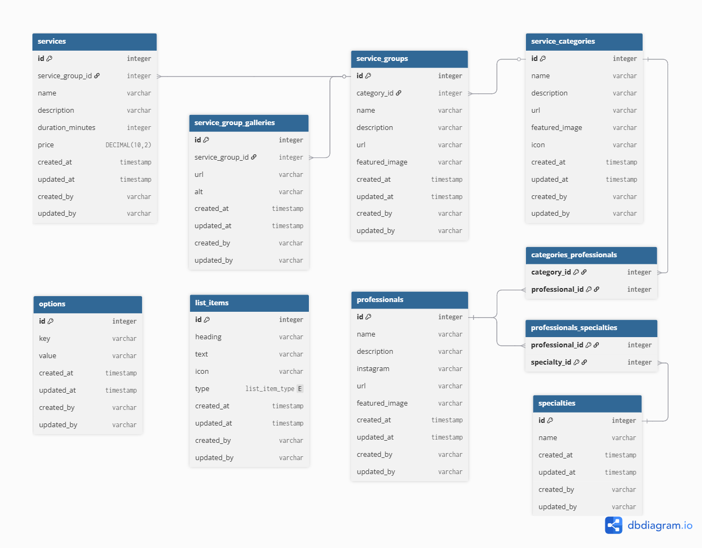

# 1. Context

## 1.1. Project Overview
This document defines the Entity-Relationship and Logical data models for the Espaço Valter Cardoso CMS.

## 1.2. Business Objective
To provide a robust and dynamic back-end foundation that allows administrators to seamlessly update website content. It is designed to act as a digital showcase, highlighting the salon's authority in the beauty and aesthetics market.

## 1.2. System Scope
The architecture handles complex relationships within the beauty industry, such as linking professionals to multiple multidisciplinary specialties, categorizing services into specific groups, managing image galleries, and controlling dynamic UI elements (like list items and global options) directly from the database.

# 2. Entity-Relationship Diagram
🔗 [Diagram file](../database/schema.dbml)

# 3. Logical Model
*All tables, except the pivot tables, include standard audit columns (created_at, updated_at, created_by, updated_by).*

## 3.1. services

| id | group_id | name | description | duration_minutes | price |
|---|---|---|---|---|---|
| 1 | 1 | Corte feminino 1 | Service description... | 30 | 90.00 |
| 2 | 1 | Corte feminino 2 | Service description... | 60 | 120.00 |
| 4 | 4 | Tintura 1 | Service description... | 120 | 150.00 |
| 8 | 5 | Mechas 1 | Service description... | 360 | 90.00 |
| 9 | 5 | Mechas 2 | Service description... | 3.0 | 90.00 |

## 3.2. service_groups

| id | category_id | name | description | url | featured_image |
|---|---|---|---|---|---|
| 1 | 1 | Corte feminino | Lorem ipsum | /.../corte-feminino | /.../corte-feminino-cover.jpeg |
| 2 | 1 | Corte masculino | Lorem ipsum | /.../corte-masculino | /.../corte-masculino-cover.jpeg |
| 3 | 1 | Corte infantil | Lorem ipsum | /.../corte-infantil | /.../corte-infantil-cover.jpeg |
| 4 | 1 | Tintura | Lorem ipsum | /.../tintura | /.../tintura-cover.jpeg |
| 5 | 1 | Loiros | Lorem ipsum | /.../loiros | /.../loiros-cover.jpeg |

## 3.3. service_group_galleries

| id | group_id | url | alt |
|---|---|---|---|
| 1 | 1 | /.../corte-feminino-01.jpeg | Lorem ipsum... |
| 2 | 1 | /.../corte-feminino-02.jpeg | Lorem ipsum... |
| 4 | 2 | /.../corte-masculino-01.jpeg | Lorem ipsum... |
| 5 | 2 | /.../corte-masculino-02.jpeg | Lorem ipsum... |
| 7 | 3 | /.../corte-infantil-01.jpeg | Lorem ipsum... |
| 8 | 3 | /.../corte-infantil-02.jpeg | Lorem ipsum... |
| 9 | 4 | /.../tintura-01.jpeg | Lorem ipsum... |
| 10 | 5 | /.../loiros-01.jpeg | Lorem ipsum... |
| 11 | 5 | /.../loiros-02.jpeg | Lorem ipsum... |

## 3.4. service_categories

| id | name | description | url | featured_image | icon |
|---|---|---|---|---|---|
| 1 | Cabelo | Lorem ipsum | /cabelo | /.../.cabelo-cover.jpeg | /.../cabelo.svg |
| 2 | Estética | Lorem ipsum | /estetica | /.../estetica-cover.jpeg | /.../estetica.svg |
| 3 | Unhas | Lorem ipsum | /unhas | /.../unhas-cover.jpeg | /.../unhas.svg |

## 3.5. professionals

| id | name | description | instagram | url | featured_image |
|---|---|---|---|---|---|
| 1 | Núbia | Lorem ipsum | nubia | /.../nubia | /.../nubia.jpeg |
| 2 | Juliana | Lorem ipsum | juliana | /.../juliana | /.../juliana.jpeg |
| 3 | Valter | Lorem ipsum | valter | /.../valter | /.../valter.jpeg |
| 4 | Cristiane | Lorem ipsum | cristiane | /.../cristiane | /.../cristiane.jpeg |
| 5 | Adriana | Lorem ipsum | adriana | /.../adriana | /.../adriana.jpeg |

## 3.6. specialties

| id | name |
|---|---|
| 1 | Cabeleireiro |
| 2 | Esteticista |
| 3 | Manicure |

## 3.7. professionals_specialties

| professional_id | specialty_id |
|---|---|
| 1 | 2 |
| 2 | 1 |
| 3 | 1 |
| 4 | 3 |
| 5 | 1 |

## 3.8. list_items

| id | heading | text | icon | type |
|---|---|---|---|---|
| 1 | Feature heading 01 | Lorem ipsum... | /.../ft-01.svg | feature |
| 2 | Feature heading 02 | Lorem ipsum... | /.../ft-02.svg | feature |
| 3 | Feature heading 03 | Lorem ipsum... | /.../ft-03.svg | feature |
| 4 | Talking point heading 01 | Lorem ipsum... | /.../tp-01.svg | talking-point |
| 5 | Talking point heading 02 | Lorem ipsum... | /.../tp-02.svg | talking-point |
| 6 | Talking point heading 03 | Lorem ipsum... | /.../tp-03.svg | talking-point |

## 3.9. options

| id | key | value | updated_at | updated_by |
|---|---|---|---|---|
| 1 | address | Rua Presidente Getúlio Vargas... | 2026-03.14 | user01 |
| 2 | phone | (11) 90000-0000 | 2026-03.14 | user01 |
| 3 | email | example@business.com.br | 2026-03.15 | user01 |
| 4 | call-to-action-heading | ... | 2026-03.16 | user02 |
| 5 | call-to-action-text | ... | 2026-03.16 | user02 |
| 6 | call-to-action-button | Click here | 2026-03.16 | user02 |

## 3.10. categories_professionals

| category_id | professional_id |
|---|---|
| 1 | 2 |
| 1 | 3 |
| 1 | 5 |
| 1 | 1 |
| 2 | 1 |
| 3 | 4 |

# 4. Physical model

🔗 [Database creation file](../database/setup.sql)